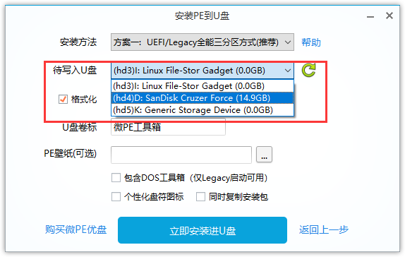

# 2 制作PE（预安装环境）启动设备

`本节涉及操作会抹掉 U 盘内全部数据，且无恢复可能。`

`请在制作前斟酌对重要文件进行备份。遵从 SOP 的指示进行操作可以尽量避免数据与其他方面的损失。`

`本章节提到的任何网站、组织、软件皆为志愿者实际使用过程中表现良好、环境纯净的，不代表 Blessing Studio 为此背书。`

## 使用微 PE 制作 U 盘 PE 环境

```text
从 http://www.wepe.com.cn/download.html 获取微 PE 工具箱安装程序
本段演示使用推荐选择的微 PE 工具箱 V2.0，64 位版本（更新于 2017-03-21)
```

1.先行确认 U 盘内无重要数据、可以被格式化后继续下一步。

提醒：本步骤会抹掉 U 盘内全部数据，而无恢复可能。请在制作前斟酌对重要文件进行备份。遵从 SOP 的指示进行操作可以尽量避免不必要的损失.

2.双击/右键单击选择“以管理员身份运行”下载的微 PE 工具箱程序. \(一般文件名为 wepe\_64.exe\)

3.点击程序右下角“其他安装方式”的 U 盘图标\(已红框标识\).


4.在“待写入 U 盘”下拉列表\(红框标识\)选择正确的 U 盘，**建议打开对应盘符的存储空间确认无误.**

`若有个性化需求，可自行选择修改“PE 壁纸”“个性化盘符图标”“U 盘卷标”.`



5.点击“立即安装进 U 盘”，确认继续制作“开始制作”，等待制作完成.

`此操作可能耗费较长时间. 如遇到进度条长时间不动的情况, 也请耐心等待.`

6.制作完成后，单击“完成安装”，退出微 PE 工具箱制作程序.


7.（可选）如要进一步确定制作是否成功, 可以右键计算机图标-管理, 而后在磁盘管理中查看 U 盘的分区表. 如所查看到内容为下图所示, 则基本可以确定制作成功.


## 使用优启通制作 U 盘 PE 环境

```text
从 https://www.itsk.com/idata/headerUrlRedirect.php?index=3
获取优启通制作程序。
本章节演示使用 3.5.2019.1226 版本 (2020 年 2 月截止最新）
本章节演示使用 Sandisk USB2.0 的 8GB U 盘，仅为演示用，
我们仍建议您准备一个容量为 16G （或以上）的 U 盘。
```

1.先行确认 U 盘无重要数据、可以被格式化后继续下一步。

**提醒：本步骤会抹掉 U 盘内全部数据，而无恢复可能。请在制作前斟酌对重要文件进行备份。遵从 SOP 的指示进行操作可以尽量避免不必要的损失.**

2.打开解压后得到的 EasyU\_\[大版本号\].exe（如演示版本：EasyU\_v3.5.exe\)，您可以见到如图所示的主页面。


3.在“选择磁盘”下拉列表选择正确的 U 盘，建议打开对应盘符的存储空间确认无误。


4.（可选）您可以设置壁纸，满足个性化需求

5.确认被制作 U 盘无误、无重要数据，点击“全新制作”，确认继续制作，等待制作完成。具体制作时间取决于 U 盘写入速度。


6.制作完成。退出程序但不要弹出设备，等待下一步继续使用。


7.如希望检查是否成功制作，请不要退出主程序，确定后点击分区管理，若结构如图所示（一个 UD 分区、一个存放数据分区、一个 EFI 分区）则为安装成功


\*\*\*\*

