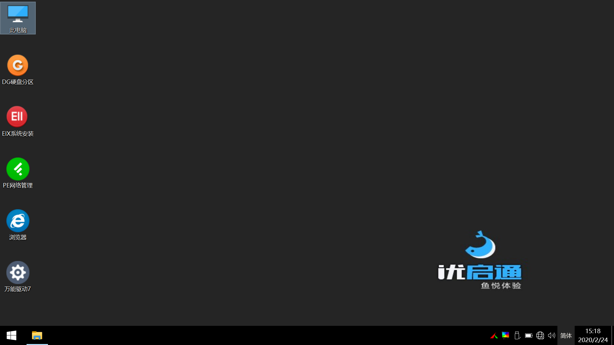
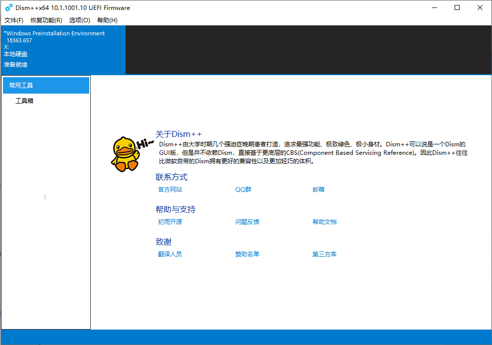
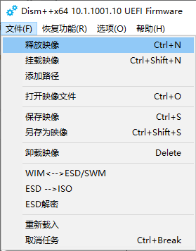
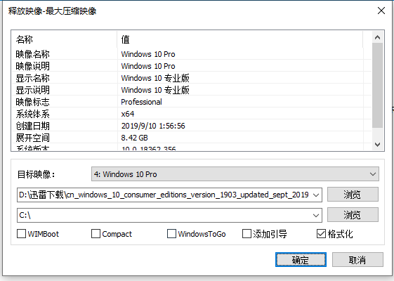

# 5 开始安装操作系统

`提醒：本节操作涉及不可逆的数据损失，请务必做好备份、三思后决定下一步；且不要做SOP未指定的动作，因没有备份、额外操作导致的数据丢失，Blessing Team不为此负任何层面上的责任。`

首先您要保证之前制作有 PE 的 U 盘连接在电脑上，且可以正常访问。

随后， 您应该关闭您的计算机。 

在再次启动时，您应该尝试在按下电源键的同时迅速反复敲击您设备的启动设备选择热键，直至看到启动菜单。

如果您不清楚自己使用电脑的启动菜单热键，请在网上查询、参阅主机厂商或主板厂商说明书。附录 **可能会** 维护一份热键清单。

随后进入引导设备选择菜单。一般情况使用键盘 上 / 下 按键高亮条目，按下 `Enter` 按键确认。

**不同设备的引导菜单可能有差异，但差异不大。**

此处要选择的设备是您做了 PE 的 U 盘. 列表里可以看见每个启动设备的名称。U 盘则通常带有"USB" "UDisk" "Flash"等字样，或者是 U 盘的品牌名称，可以用于与其他启动项区分。

**如果要进一步确认自己的 U 盘名称，可以重启前在设备管理器中查看。此处不赘述。**

若非特殊需求（如：与 Windows7 甚至更旧的操作系统共存），**我们建议使用UEFI启动方式。**

不出意外，您将看到如下页面。

**注意：这一步骤开始，您将损失所有的** _**系统盘内**_ **数据，且操作不可逆，请务必检查备份是否已经准备、重要数据是否已经迁移。**

`本操作涉及不可逆的数据损失，请务必做好备份、三思后决定下一步；且不要做SOP未指定的动作，因没有备份、额外操作导致的数据丢失，Blessing Team不为此负任何层面上的责任。`

接下来的部分，我们展示两种工具使用时的操作。



1.进入 PE 后， 建议您先打开桌面上的 "计算机" 图标确定原系统盘符， 而后再打开 Dism++，准备进行系统安装。 当您启动 Dism++之后，应当出现一个类似下图的界面：  

2.此时您可以按下 `Ctrl+N` ，也可在 `文件` 菜单内找到 `释放镜像` 选项。

3.在弹出的对话框中， 选择好您的系统盘盘符 \(或安装的目标磁盘\) 与下载的 Windows 镜像文件。 

格式化与否， 则应当根据实际情况来考虑。 一般地，系统盘盘符分配为 `C:` ，但是我们仍然建议您在确认原系统盘符后操作。 \(详见附录\)

**4. 建议的交叉检查：**

* 是否断开了其他不需要使用的 U 盘设备
* 是否确认了安装盘目标就是安装系统的系统盘
* 是否准备好了重要数据的备份

5. 开始安装

在确认一切交叉检查完成无误后， 便可以点击确定进行安装了。 如未出现意外， 您应该可以顺利结束本过程。 

值得注意的是， 如果您在使用传统引导方式， 则建议勾选"添加引导"；而如果您在使用 uEFI 引导方式且计算机上本身安装有系统， 则不建议勾选。

**若您确实担心您的原始数据安全，大可不必勾选"格式化"，在完成操作系统安装后，您的全部原始数据将保存在 “X:\Windows.old.00x” 文件夹。\(X 为您系统盘的盘符，通常为 C;x 为一个常数\) 完成安装之后，您可以拷贝这一文件夹内的数据到现有的操作系统，并使用 `驱动器清理` 实用程序安全的删除旧有备份。**

判断两种引导方式的方法， 请参见附录后续更新。 

如果因为操作失误造成了引导丢失\(不能正常启动系统\)， 附录也能给您一定的指引。

6. 步骤结束

此时点击对话框的 `确定` ，完成安装流程。

* 若您是 UEFI 引导用户，且没有删除其他必要的分区\(EFI MSR\)，您可以直接重新引导到操作系统。
* 若您是 传统方式 引导用户，您需要参阅附录部分内容进行引导修复。



\*\*\*\*



\*\*\*\*



\*\*\*\*

